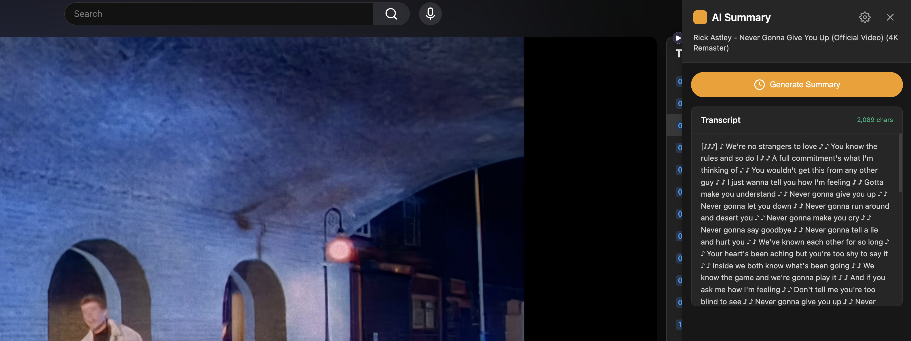
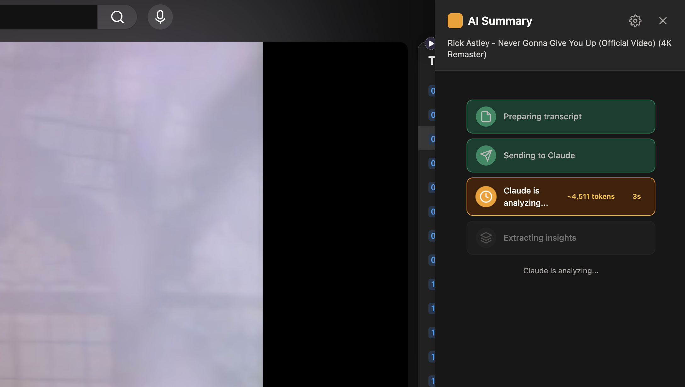
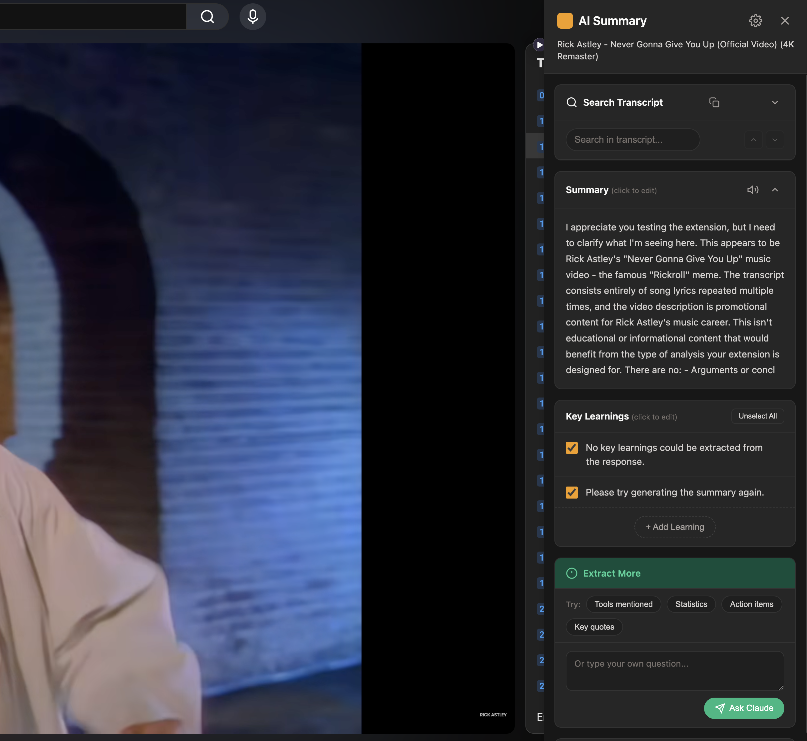
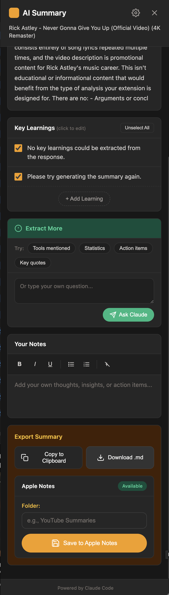

# YouTube Summary Extension

> Generate AI-powered summaries of YouTube videos using Claude and save them to Apple Notes.


## What is this?

YouTube Summary Extension is a Chrome extension that uses your Claude Code subscription to generate concise summaries and key learnings from any YouTube video with captions. It extracts actionable insights and saves them directly to Apple Notes with folder organization.

## Key Features

| Feature | Description |
|---------|-------------|
| **AI Summaries** | Claude analyzes video transcripts to create concise summaries |
| **Key Learnings** | Automatically extracts 5-7 actionable takeaways |
| **Action Items** | Generates tasks and syncs them to Apple Reminders |
| **Audio Narration** | Listen to summaries with ElevenLabs text-to-speech |
| **Apple Notes** | Save everything organized by folder |
| **Transcript Search** | Search and highlight text in the full transcript |
| **Follow-up Questions** | Ask Claude for more details on specific topics |

## Quick Start

1. **[Installation](Installation)** - Set up the extension and native host
2. **[Usage Guide](Usage-Guide)** - Learn how to generate and save summaries
3. **[Features](Features)** - Explore all capabilities
4. **[Settings](Settings)** - Customize Claude's analysis
5. **[Troubleshooting](Troubleshooting)** - Fix common issues

## How It Works

```
YouTube Video → Extract Transcript → Claude Analysis → Summary + Learnings → Apple Notes
```

The extension uses Chrome's Native Messaging API to communicate with a local Node.js process that runs Claude Code CLI. This means:

- **No API costs** - Uses your existing Claude Code subscription
- **Privacy first** - Everything runs locally on your machine
- **macOS integration** - Native Apple Notes and Reminders support

## Requirements

- macOS (for Apple Notes integration)
- Google Chrome or Chromium-based browser
- Node.js v14+
- Claude Code CLI with active subscription

## Screenshots

### Popup Banner
When you visit a YouTube video, a popup appears offering to summarize it.


### Sidebar with Transcript
Open the sidebar to preview the transcript and generate a summary.



### Progress Tracking
Watch real-time progress as Claude analyzes the video.



### Summary Results
View the summary, key learnings, and use "Extract More" for follow-up questions.



### Export Options
Copy to clipboard, download as Markdown, or save to Apple Notes.



---

**Ready to get started?** Head to the **[Installation Guide](Installation)** →
