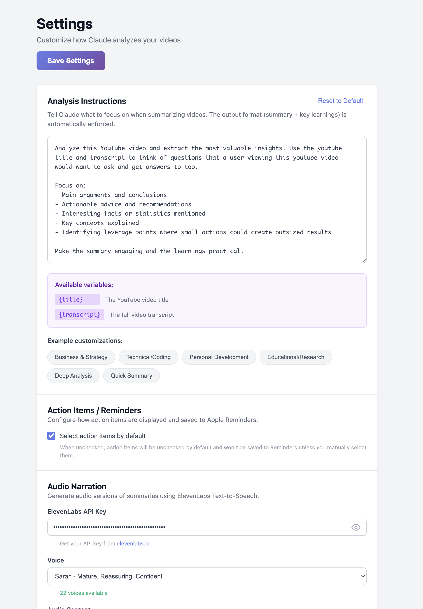

# Settings

Customize how Claude analyzes your videos and configure audio narration.

## Accessing Settings

Click the **gear icon** in the sidebar header to open Settings.


## Analysis Instructions

### Custom Prompts

Tell Claude what to focus on when summarizing videos. Your instructions are combined with a system prompt that ensures consistent output format.



### Available Variables

| Variable | Description |
|----------|-------------|
| `{title}` | The YouTube video title |
| `{transcript}` | The full video transcript |

### Example Customizations

Click any preset to load it instantly:

| Preset | Best For |
|--------|----------|
| **Business & Strategy** | Business videos, entrepreneurship |
| **Technical/Coding** | Programming tutorials, tech talks |
| **Personal Development** | Self-help, productivity content |
| **Educational/Research** | Academic content, documentaries |
| **Deep Analysis** | When you want comprehensive notes |
| **Quick Summary** | When you need brief takeaways |

### Custom Instructions Examples

#### For Business Content
```
Focus on actionable business insights and strategies.
Extract learnings that can be immediately applied to
grow a business or improve processes.
```

#### For Technical Content
```
Focus on technical concepts and implementation details.
Extract learnings about coding patterns, architecture
decisions, and best practices.
```

#### For Learning/Study
```
Focus on key facts, research findings, and educational
content. Extract learnings that are backed by evidence
or expert knowledge.
```

#### For Quick Review
```
Be extremely concise. Provide a 2-3 sentence summary
and only the 3 most critical takeaways.
```

### How It Works

Your instructions are combined with a system format:

```
[Your instructions]

+

SUMMARY:
[2-3 paragraph summary]

KEY LEARNINGS:
- [Learning 1]
- [Learning 2]
- ...

ACTION ITEMS:
- [Task 1]
- [Task 2]
- ...
```

This ensures Claude always outputs in the format the extension can parse.

## Action Items / Reminders

### Default Selection

Control whether action items are pre-selected:

| Setting | Behavior |
|---------|----------|
| **Checked (default)** | Action items are selected by default and saved to Reminders |
| **Unchecked** | Action items are unchecked; manually select which to save |


This is useful if you prefer to review action items before committing to them.

## Audio Narration

Configure ElevenLabs text-to-speech for audio summaries.

### API Key

1. Go to [elevenlabs.io/app/settings/api-keys](https://elevenlabs.io/app/settings/api-keys)
2. Create or copy your API key
3. Paste it in the API Key field
4. Click the **eye icon** to show/hide the key


### Voice Selection

After entering your API key:

1. The voice dropdown will populate automatically
2. Voices are grouped by category (Premade, Cloned, etc.)
3. Select your preferred voice
4. The selection is saved automatically


### Audio Content

Choose which sections to include in audio:

| Section | Default | Description |
|---------|---------|-------------|
| **Summary** | ✓ On | The 2-3 paragraph summary |
| **Key Learnings** | ✓ On | All extracted learnings (numbered) |
| **Action Items** | Off | Task list with due dates |


## Saving Settings

Click **Save Settings** to apply your changes.


Settings are synced across devices via Chrome Sync.

## Resetting to Defaults

### Reset Analysis Instructions
Click **Reset to Default** next to Analysis Instructions to restore the original prompt.

### Reset All Settings
To reset all settings:
1. Go to `chrome://extensions/`
2. Find YouTube Summary Extension
3. Click **Details** → **Extension options** → **Clear data**

Or manually clear via Chrome DevTools:
```javascript
chrome.storage.sync.clear()
```

## Settings Storage

Settings are stored in Chrome's sync storage:

| Key | Description |
|-----|-------------|
| `analysisInstructions` | Custom Claude prompt |
| `remindersCheckedByDefault` | Action items default state |
| `elevenlabsApiKey` | ElevenLabs API key |
| `elevenlabsVoiceId` | Selected voice ID |
| `audioIncludeSummary` | Include summary in audio |
| `audioIncludeLearnings` | Include learnings in audio |
| `audioIncludeActions` | Include action items in audio |

---

**Next:** Fix common issues → **[Troubleshooting](Troubleshooting)**
